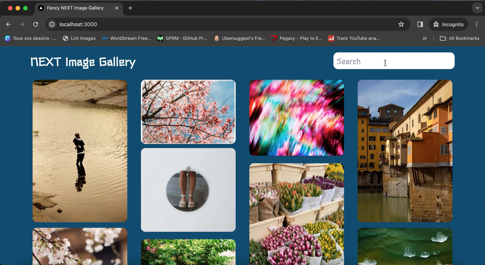
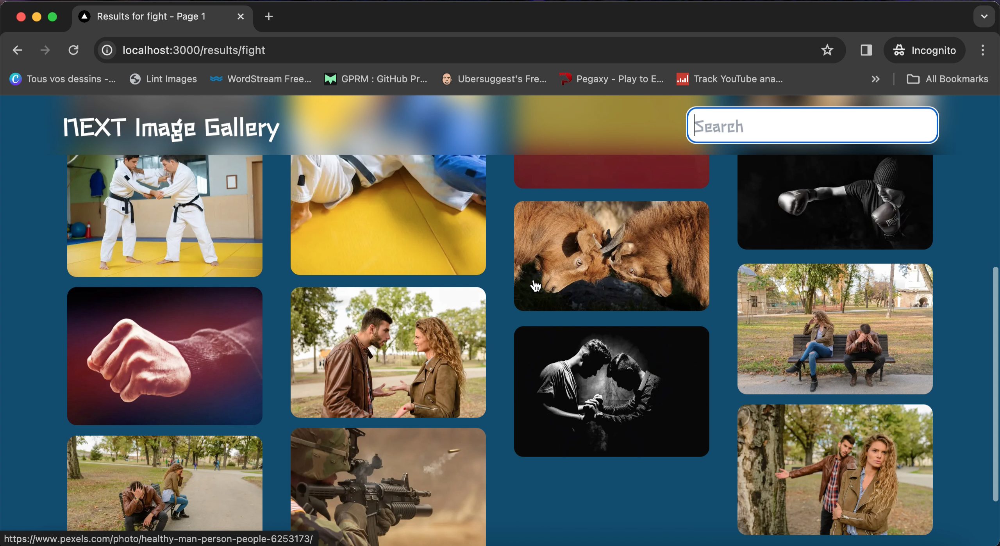

# NEXT IMAGE GALLERY





A minimalistic image gallery where you can browse, search and open images from the Pexels API

## Get going

Go create an account and grab your api key on https://www.pexels.com/api/new/. Create a file called .env.local and smash the API key in there as the following:

```
PEXELS_API_KEY=
```

Then install dependencies

```
npm install
```

Now go live !!!

```
npm run dev
```

## Tech Stack

Next.js
Typescript
Zod
Tailwind
Pexels APi
